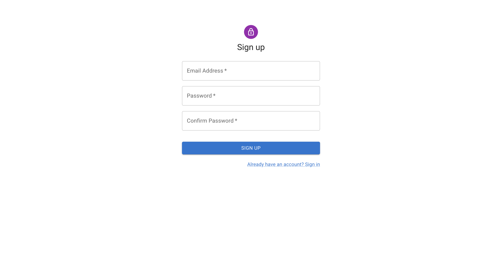
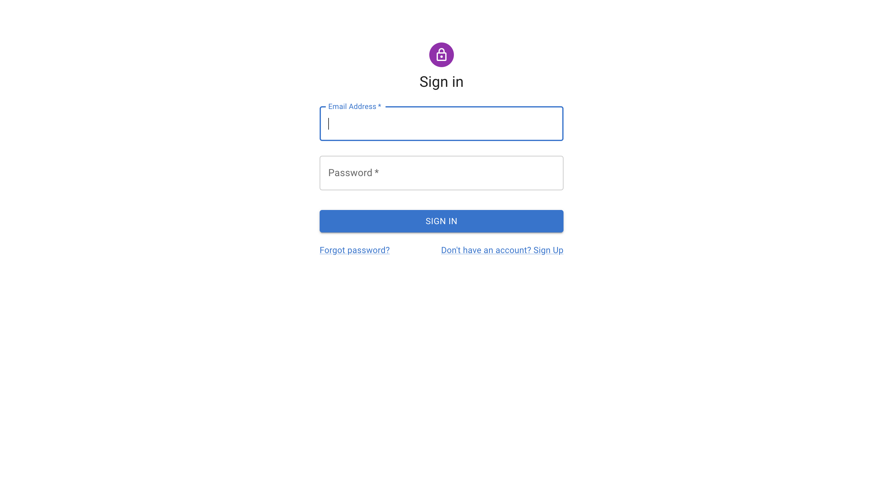

# Authentication form

A signup/signin react component form, built using the Material UI and integrated with React.js open source form library Formik and Yup for authentication.

Note: This is a Vite, React and Typescript project bootstrapped using [Vite](https://vitejs.dev/guide/)

## Demo
Here is a working live demo :  https://deluxe-alpaca-8f3fb4.netlify.app/

## Site

### Sign Up page

- The form includes Email, password and confirm password fields.
- Includes validations for the fields, for example email (must be a valid email) and, password (must be at least 8 characters long and include at least a number and an uppercase alphabet) and also match with confirm password field.
- Shows success message on registration success and navigates user to login page.
- Uses local storage to persist the users account information.

### Sign In page

- Contains email and password field in with field validations.
- On successful login the user is greeted with a success message and navigated to the authenticated page.
- The authenticated page is only accessible if the user is logged in.

## Built with 

- [Formik](https://formik.org/) - Formik is the world's most popular open source form library for React. Formik can be useful when we want to do in-place validation and give specific input format.
- [Yup](https://www.sanity.io/guides/form-validation-with-npm-yup) - Yup is an object schema builder for value parsing and validation.
- [Material UI](https://mui.com/) - Extensive list of components and  Bundled Javascript plugins.

## Useage

In the project library run:

### `npm install`
Downloads dependencies defined in a `package. json` file and generates a `node_modules` folder with the installed modules.

### `npm run dev`

Runs the app in the development mode. 
Open [http://localhost:3000](http://localhost:3000) to view it in the browser.

## Available Scripts

### `npm run build`

Builds the app for production to the `dist` folder. 
It correctly bundles React in production mode and optimizes the build for the best performance.

The build is minified and the filenames include the hashes. 
Your app is ready to be deployed!

